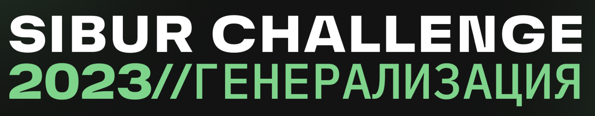
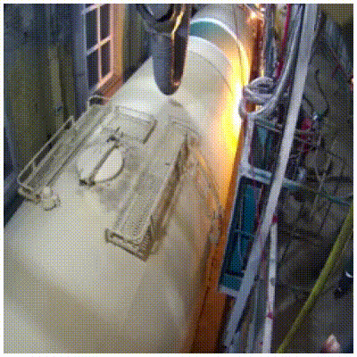
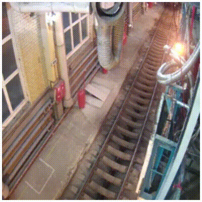
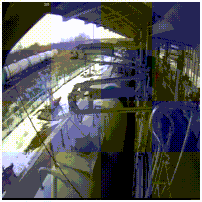

# SIBUR Challenge 2023 (3rd place)

SIBUR 2023 challenge video recognition task

# Videos examples
| Bridge up | Bridge down | No Action | Train in out |
|  |  |  |  |

# Final code for video classification 
**Public score:** 0.989044

**Private score:** 0.991651

- [Training & models converting](./video_recognition/torch_video.ipynb)
- [Check inference prediction](./video_recognition/predict.ipynb)
- [Show video transformations](./video_recognition/video_processing.ipynb)

# Just one frame recognition
**Public score:** 0.62246

- [Config](video_frames_recognition/config.py)
- [Main script](video_frames_recognition/exp_train.py)
- [Dataset class](video_frames_recognition/dataset.py)
- [Trainer class](video_frames_recognition/training.py)
- [Export model script](video_frames_recognition/export_model.py)
- [Additional utils](video_frames_recognition/utils.py)
- [Some data analysis](video_frames_recognition/eda.ipynb)
